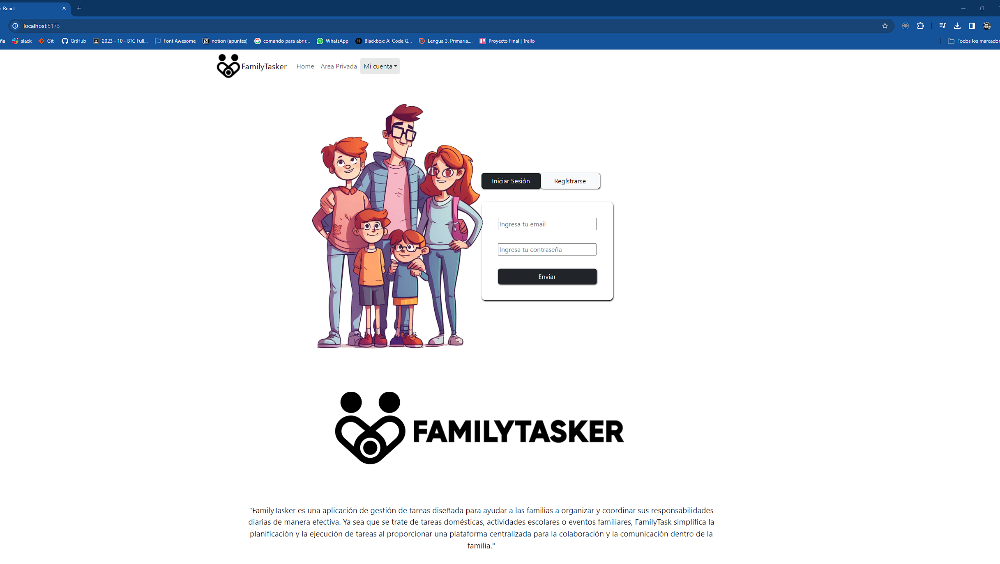
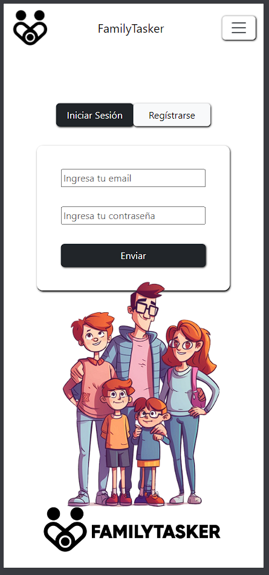

## FamilyTasker


<details>
  <summary>Contenido 📝</summary>
  <ol>
    <li><a href="#objetivo">Objetivo</a></li>
    <li><a href="#sobre-el-proyecto">Sobre el proyecto</a></li>
    <li><a href="#stack">Stack</a></li>
    <li><a href="#instalación-en-local">Instalación</a></li>
    <li><a href="#endpoints">Manual de Uso</a></li>
    <li><a href="#futuras-funcionalidades">Futuras funcionalidades</a></li>
    <li><a href="#contribuciones">Contribuciones</a></li>
    <li><a href="#licencia">Licencia</a></li>
    <li><a href="#webgrafia">Webgrafia</a></li>
    <li><a href="#desarrollo">Desarrollo</a></li>
    <li><a href="#agradecimientos">Agradecimientos</a></li>
    <li><a href="#contacto">Contacto</a></li>
  </ol>
</details>

## Objetivo
Crear una aplicación para la mejor gestión de tas tareas de una familia.  

<a href="https://github.com/ReynaldoMunozF/king_tattoo_backend" target="_blank"></a> 


## Sobre el proyecto
"FamilyTasker es una aplicación de gestión de tareas diseñada para ayudar a las familias a organizar y coordinar sus responsabilidades diarias de manera efectiva. Ya sea que se trate de tareas domésticas, actividades escolares o eventos familiares, FamilyTask simplifica la planificación y la ejecución de tareas al proporcionar una plataforma centralizada para la colaboración y la comunicación dentro de la familia."

## Stack
Tecnologías utilizadas:
<div >
<li>REACT</li>    
<li>REACT BOOTSTRAP</li>    
<li>JAVASCRIPT</li>    
<li>HTML</li>    
<li>NODE JS</li>    
<li>EXPRESS</li>    
<li>TYPEORM</li>    
<li>MYSQL</li>    
<li>DOCKER</li>    
   
 </div>

<!-- [](https://reactjs.org/) [](https://vitejs.dev/) [](https://developer.mozilla.org/en-US/docs/Web/JavaScript) [](https://redux.js.org/) [](https://jwt.io/introduction) [](https://getbootstrap.com/) [](https://axios-http.com/) -->

## Instalación en local
1. Clonar el repositorio tanto de back-end y front-end
2. ` $ npm install ` 
3. Conectamos nuestro repositorio con la base de datos 
4. ``` $ Ejecutamos las migraciones ``` 
5. ``` $ npm run dev ``` en el back-end
6. ``` $ npm run dev ``` en el front-end


## Manual de Usuario






Dejo una Demo de la aplicación funcionando en local en el siguiente enlace
- https://we.tl/t-EeLRtRXg3H


## Futuras funcionalidades
[ ] Añadir mascotas 
[ ] Mejorar el diseño del perfil de la familia
[ ] mensajería  
 

## Contribuciones
Las sugerencias y aportaciones son siempre bienvenidas.  

Puedes hacerlo de dos maneras:

1. Abriendo una issue
2. Crea un fork del repositorio
    - Crea una nueva rama  
        ```
        $ git checkout -b feature/nombreUsuario-mejora
        ```
    - Haz un commit con tus cambios 
        ```
        $ git commit -m 'feat: mejora X cosa'
        ```
    - Haz push a la rama 
        ```
        $ git push origin feature/nombreUsuario-mejora
        ```
    - Abre una solicitud de Pull Request

## Licencia
Este proyecto se encuentra bajo licencia de "MIT License"

## Webgrafia:
Para conseguir mi objetivo he recopilado información de:
- https://react-bootstrap.netlify.app/
- https://www.npmjs.com/package/react-datepicker


## Agradecimientos:

Agradezco al claustro de GeeksHub por el tiempo dedicado a darnos el contenido y el continuo seguimiento.

a mi familia por su apoyo durante todo este proceso, por sus palabras de aliento y su permanente e incondicional amor.
A mi hermano le debo una cerveza por se mi patito de goma favorito (gracias por aguantar la chapa)


- ***Rodrigo***  
<a href="https://github.com/el-ro" target="_blank"></a> 

## Contacto
<a href = "mailto:reynaldo.munozf21@gmail.com"></a>
<a href="www.linkedin.com/in/reynaldo-muñoz-flores" target="_blank"></a> 
</p>
